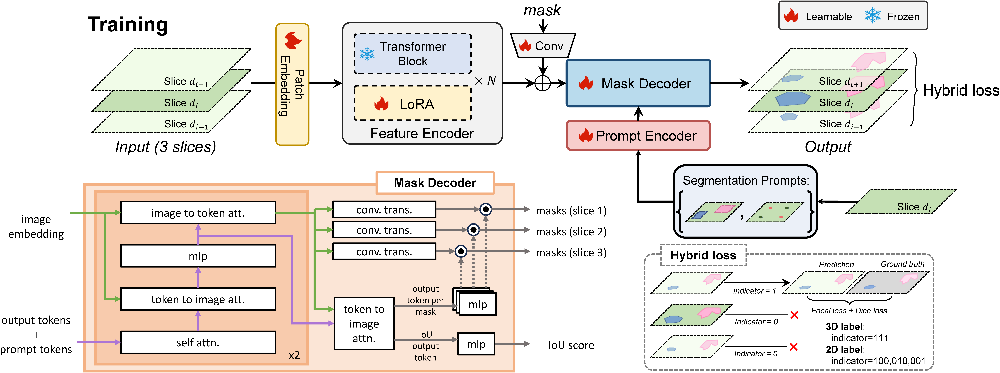

# Slide-SAM: Medical SAM meets sliding window


<p align="center" width="100%">

</p>


<div align="center">
    <span class="author-block">
    <a href="https://scholar.google.com/citations?user=mlTXS0YAAAAJ&hl=en" target="_blank">Quan Quan</a><sup>1,2*</sup>,
    </span>
    <span class="author-block">
    <a href="https://scholar.google.com/citations?user=x1pODsMAAAAJ&hl=en" target="_blank">Fenghe Tang</a><sup>3*</sup>,</span>
    <span class="author-block">
    </span>
    <a href="https://scholar.google.com/citations?user=TxjqAY0AAAAJ&hl=en" target="_blank">Zikang Xu</a><sup>3</sup>,
    </span>
    <span class="author-block">
    <a href="https://scholar.google.com/citations?user=YkfSFekAAAAJ&hl=en" target="_blank">Heqin Zhu</a><sup>3</sup>,
    </span>
    <span class="author-block">
    <a href="https://scholar.google.com/citations?user=8eNm2GMAAAAJ&hl=en" target="_blank">S.Kevin Zhou</a><sup>1,2,3</sup>
    </span>
</div>


<div align="center">
    <sup>1</sup> <a href='http://english.ict.cas.cn/' target='_blank'>Institute of Computing Technology, Chinese Academy of Sciences</a>
    <br>
    <sup>2</sup>
    <a href='https://english.ucas.ac.cn/' target='_blank'>University of Chinese Academy of Sciences</a>&emsp;
    </br>
    <sup>3</sup>
    <a href='https://en.ustc.edu.cn/' target='_blank'>School of Biomedical Engineering, University of Science and Technology of China</a>&emsp;
    </br>
    <sup>*</sup> Equal Contribution&emsp;
</div>
<br>

[](https://arxiv.org/pdf/2311.10121.pdf)
[](https://github.com/Curli-quan/Slide-SAM)
<a href="#LICENSE--citation">
  </a>


## TODOs

- [x] Paper released
- [x] Code released
- [x] Slide-SAM-B weights  released
- [x] Slide-SAM-H weights released


## Models

### Large scale Medical Image Pretrained Weights

|    Name     | Resolution  |   Prompt    |                           Weights                            |
| :---------: | :---------: | :---------: | :----------------------------------------------------------: |
| Slide-SAM-B | 1024 x 1024 | box & point | [Google Drive](https://drive.google.com/file/d/1YJ7deylSXfEwRfOAc72zBJE1xGlxSnp0/view?usp=drive_link) \| [Baidu Disk (7be9)](https://pan.baidu.com/s/1jvJ2W4MK24JdpZLwPqMIfA) |
| Slide-SAM-H | 1024 x 1024 | box & point | [Google Drive](https://drive.google.com/file/d/1KnSL5mgAdUDsktvrwcYp_9IJeqfFWhIN/view?usp=drive_link) \| [Baidu Disk (05dy)](https://pan.baidu.com/s/1jnOwyWd-M1fBIauNi3IA4w) |


## Getting Started

### Install tutils tools

```
pip install trans-utils
```

### Prepare datasets

We recommend you to convert the dataset into the nnUNet format.

```
00_custom_dataset
  imagesTr
    xxx_0000.nii.gz
    ...
  labelsTr
    xxx.nii.gz
    ...
```

Try to use the function organize in  [nnunet-style](https://github.com/MIC-DKFZ/nnUNet/blob/master/documentation/dataset_format.md) or ```organize_by_names``` to prepare your custom datasets.

Then run :

```python
python -m  datasets.generate_txt
```

A ```[example]_train.txt``` will be generated in ```./datasets/dataset_list/```

The content should be like below

```
01_BCV-Abdomen/Training/img/img0001.nii.gz	01_BCV-Abdomen/Training/label/label0001.nii.gz
01_BCV-Abdomen/Training/img/img0002.nii.gz	01_BCV-Abdomen/Training/label/label0002.nii.gz
01_BCV-Abdomen/Training/img/img0003.nii.gz	01_BCV-Abdomen/Training/label/label0003.nii.gz
```

### Cache 3d volume into slices

After generating the ```[example]_train.txt``` file, check the config file ```configs/vit_b.yaml```.

Update the params in ```dataset``` by yours. And the ```dataset_list``` should be the name of the generated txt file ```[example]```.

Then run

```
python -m datasets.cache_dataset3d
```

## Configs Settings

important settings

```yaml      
base:
  base_dir: "../runs/sam/" # logging dir

dataset:
  types: ['3d'] # ['3d', '2d']
  split: 'train'
  data_root_path: '../datasets/' 
  dataset_list: ["pancreas"]
  data_txt_path: './datasets/dataset_list/'
  dataset2d_path: "../08_AbdomenCT-1K/"
  cache_data_path: '../cached_dataset2/'

  cache_prefix: ['6016'] # cache prefix of cached dataset for training
  # For example: ['07',] for 07_WORD
```


## Start Training from scratch (SAM)

Run training on multi-gpu

```
CUDA_VISIBLE_DEVICES=0,1,2,3 python -m core.ddp --tag debug
```

Run training on single-gpu

```
CUDA_VISIBLE_DEVICES=0 python -m core.ddp --tag debug
```

## Sliding Inference and Test

```
python -m core.volume_predictor
```

## Testset Validation
```python
EX_CONFIG = {       
        'dataset':{
            'prompt': 'box', # prompt type: box or point
            'dataset_list': ['word'], # dataset_list name
            'label_idx': 2, # label index for inference, 
        },       
        "pth": "./model.pth"
    }
```
```
python -m test.volume_eval
```

## Finetuning (Recommended)
```yaml      
training:
  breakpoint_path: "./model.pth" # pretrained weight path
```

```
python -m core.ddp_sub --tag run
```

## Validation with Finetuned Weights

```
  python -m test.volume_eval_sublora
```

```python
EX_CONFIG = {       
        'dataset':{
            'prompt': 'box', # prompt type: box or point
            'dataset_list': ['word'], # dataset_list name
            'label_idx': 2, # label index for inference, 
        },       
        "pth": "./model_finetuned.pth"
    }
```


## Citation

If the code, paper and weights help your research, please cite:

```
@article{quan2023slide,
  title={Slide-SAM: Medical SAM Meets Sliding Window},
  author={Quan, Quan and Tang, Fenghe and Xu, Zikang and Zhu, Heqin and Zhou, S Kevin},
  journal={arXiv preprint arXiv:2311.10121},
  year={2023}
}
```

## License

This project is released under the Apache 2.0 license. Please see the [LICENSE](LICENSE) file for more information.
